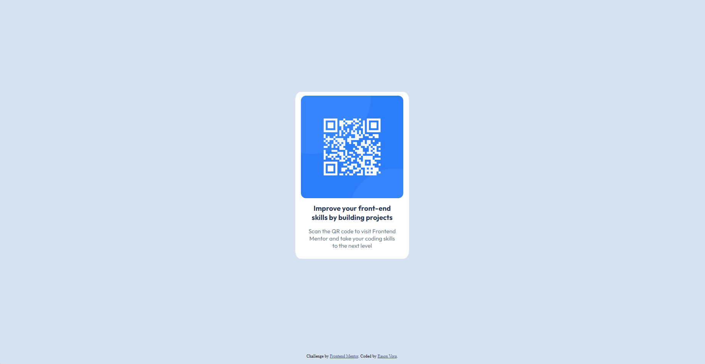

# Frontend Mentor - QR code component solution

This is a solution to the [QR code component challenge on Frontend Mentor](https://www.frontendmentor.io/challenges/qr-code-component-iux_sIO_H). Frontend Mentor challenges help you improve your coding skills by building realistic projects. 

## Table of contents

- [Screenshot](#screenshot)
- [Links](#links)
- [My process](#my-process)
- [Built with](#built-with)
- [What I learned](#what-i-learned)
- [Continued development](#continued-development)
- [Useful resources](#useful-resources)
- [Author](#author)

**Note: Delete this note and update the table of contents based on what sections you keep.**

### Screenshot




### Links

- Solution URL: [https://www.frontendmentor.io/solutions/flexbox-and-media-query-WwRBx0ABZw]
- Live Site URL: [https://easonvora.github.io/qr-code-component-main/]

## My process
1. Make IDs and classes.
2. Design [#code-text-title] (box sizes, border radius, font family, typography, colors)
3. Learn how to use [flexbox].
4. Use flexbox to center [#code-title-text] vertically and horizontally.
5. Learn how to use [@media min-width].
6. Use [@media min-width] to adjust [#code-text-title] width on different viewport/screen sizes.
7. Test screen sizes.
8. Adjust and added more [@media min-width] to make the transitions smoother.
9. Retest different screen sizes, expanding testing range.
10. Redjust and added more [@media min-width] to make the transitions smoother.
11. Adjust footer [div.attribution] to be at the bottom of the page (FAILED)
12. Readjust [flexbox] and added [main] element around [#code-text-title], but leaving out [.attribution]
13. Add flex wrap to [body] element and changed the [align-items] attribute value from [center] to [last baseline] while exploring different autofill codes for [align-items] values. ([.attribution] placement SUCCESSFUL)

### Built with

- Semantic HTML5
- CSS
- Flexbox
- Media Query
- VSCode
- GitHub

### What I learned

1. Flexbox
    ```
    body {
        display: flex;
        flex-wrap: wrap;
        justify-content: center;
        align-items: last baseline;
        height: 100vh;
    }
    ```
2. Media Query
    ```
    @media screen and (min-width: 500px) {
        #code-title-text {
            width: 50%;
        }
    }
    ```

### Continued development

1. Flexbox
2. Media Query
3. Grid
4. Responsive Design

### Useful resources

- [Chat GPT] Explained how to use flexbox and media query in (too much) detail, showed examples

## Author

- Website - [Eason Vora](https://www.your-site.com)
- Frontend Mentor - [@EasonVora](https://www.frontendmentor.io/profile/EasonVora)
- LinkedIn - [Eason Vora](https://www.linkedin.com/in/eason-vora-5a043b262/)

